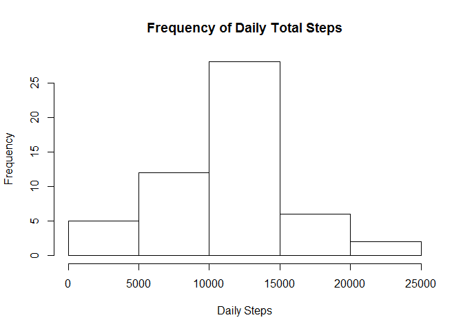
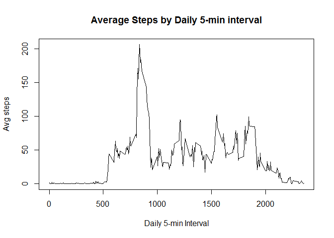
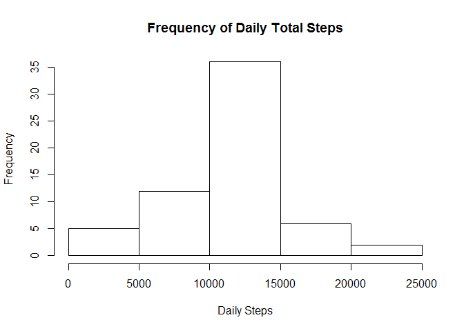
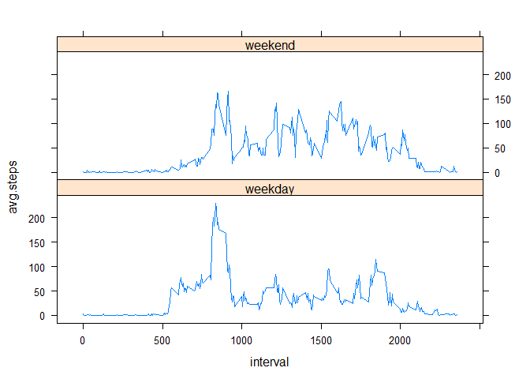

# Reproducible Research: Peer Assessment 1


First, cleanup environment by removing all existing variables


```r
rm(list=ls(all=TRUE)) 
```

## Loading and preprocessing the data

Load in & clean up the data

```r
data <- read.csv(unz("activity.zip","activity.csv"))
data$date <- as.POSIXct(data$date) # set the dates to POSIXct
```

## What is mean total number of steps taken per day?

use the aggregate function to find the daily totals

```r
t0 <- aggregate(steps~date, data = data, sum, na.rm = TRUE)
```

Make a histogram of the total number of steps taken each day

```r
hist(t0$steps, xlab = "Daily Steps", main= "Frequency of Daily Total Steps")
```

<!-- -->

Calculate the mean and median total number of steps each day

```r
mean(t0$steps)
```

```
## [1] 10766.19
```

```r
median(t0$steps)
```

```
## [1] 10765
```

## What is the average daily activity pattern?

first use the aggregate function to find the interval averages

```r
t1 <- aggregate(steps~interval, data=data, mean, na.rm=TRUE)
```

make time series plot

```r
plot(t1, type ="l", xlab = "Daily 5-min Interval", ylab = "Avg steps", 
         main= "Average Steps by Daily 5-min interval")
```

<!-- -->

find the interval with the maximum average

```r
max_int <- which.max(t1$steps)
max_time <- t1[max_int,1]
```
The 104th interval, or the interval starting at 835

## Imputing missing values

find the number of NA rows

```r
sum(is.na(data$steps))
```

```
## [1] 2304
```
2304 rows have missing values

* the strategy used to fill in the missing values is to replace with the average number of steps for that given 5-minute interval

first, create a function that will return the average for a user input interval if the number of steps is NA

```r
Int_Avg <- function(x){
        t1[match(x,t1$interval),2]
}
```

Modify the original data set to replace the NAs

```r
data. <- data
for(i in 1:nrow(data.)){
        if(is.na(data.[i,]$steps)){
                data.[i,]$steps <- Int_Avg(data.[i,]$interval)
        }
}
```

use the aggregate function to find the daily totals

```r
t2 <- aggregate(steps~date, data = data., sum, na.rm = TRUE)
```

Make a histogram of the total number of steps taken each day

```r
hist(t2$steps, xlab = "Daily Steps", main= "Frequency of Daily Total Steps")
```

<!-- -->

Calculate the mean and median total number of steps each day

```r
mean(t2$steps)
```

```
## [1] 10766.19
```

```r
median(t2$steps)
```

```
## [1] 10766.19
```

Imputing the missing data seemed to have had a minimal impact on the mean and median of the total daily steps  
* the change in mean was 0  
* the change in median was 1.1886792

## Are there differences in activity patterns between weekdays and weekends?

Add the Weekday/weekend identifier

```r
data.$week <- ifelse(weekdays(data.$date) == "Saturday" | weekdays(data.$date) == "Sunday" ,"weekend","weekday")

t3 <- aggregate(data.$steps, by = list(data.$week, data.$interval), mean, na.rm=TRUE)

#insert names for t3 dataframe
names(t3) = c("weekday", "interval","avg.steps")
```

Produce the panel plot

```r
library(lattice)
xyplot(avg.steps~interval | weekday, data=t3, layout = c(1,2), type="l")
```

<!-- -->

The panel plots show a similar activity pattern between weekdays and weekends. However, there seems to be higher peak activity on weekday mornings when compared to similar weekend times.
